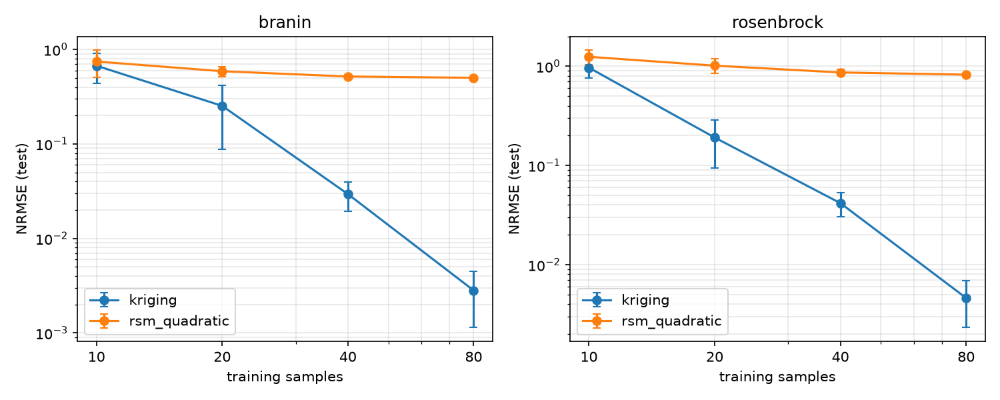

# Surrogate-Based Optimization Benchmark

A small Python benchmark that compares two metamodels (quadratic response
surface and Kriging) on analytic test functions. It also compares one-shot
surrogate-based optimization with direct optimization, measuring cost in
**true-function evaluations**, the quantity that matters when each evaluation
is an expensive simulation.

## What it does

| Part | Choice |
|---|---|
| Test functions | Branin (2D, 3 global minima), Rosenbrock (2D, curved valley) |
| Design of experiments | Latin Hypercube sampling (`scipy.stats.qmc`) |
| Surrogates | **RSM**: full quadratic polynomial, least squares. **Kriging**: GP, anisotropic Matern-5/2 kernel + nugget (`WhiteKernel`), hyperparameters by maximum likelihood with 5 restarts, inputs scaled to [0,1] |
| Accuracy metrics | RMSE, MAE, R², NRMSE (RMSE / std of test values), on a 500-point held-out LHS test set |
| Direct optimizers | SciPy Nelder-Mead and L-BFGS-B (finite-difference gradients, counted as evaluations) from a random start |
| Surrogate optimization | Fit on *n* LHS points → minimise the surrogate (10-start L-BFGS-B) → evaluate the true function once. Cost = *n* + 1 |
| Repetitions | 5 seeds per configuration |

## Run

### 1. Open a terminal in the project folder
In VS Code, press **Ctrl + `** (backtick), or use the menu **Terminal → New Terminal**.

### 2. Set up the environment (first time only, e.g. after cloning)
```bash
python3 -m venv .venv
source .venv/bin/activate
pip install -r requirements.txt
```

### 3. Turn on the environment
```bash
source .venv/bin/activate
```
You'll see `(.venv)` at the start of the prompt. That means the libraries are ready.

### 4. Run the tests
```bash
pytest -v
```
You should see **4 passed**. These check that the test functions are correct and the
sampling and models behave as expected.

### 5. Run the benchmark
```bash
python run_benchmark.py
```
It takes about 1 minute. Then it prints two tables in the terminal:
- **Surrogate accuracy:** for each function, model and sample count, the error (NRMSE),
  R² and fit time.
- **Optimization:** how many function calls each approach used (`n_evals`) and how far
  it ended from the true minimum (`gap`).

### 6. Look at the results
Open the `results/` folder:
- **`accuracy_vs_samples.png`**: the accuracy plot.
- **`accuracy.csv`** and **`optimization.csv`**: the raw data, one row per run.
- **`summary.txt`**: the same tables the terminal printed.

## Results

### Surrogate accuracy (mean NRMSE on the test set, 5 seeds; lower is better)

| Problem | n | RSM quadratic | Kriging |
|---|---|---|---|
| Branin | 10 | 0.745 | 0.672 |
| Branin | 20 | 0.587 | 0.253 |
| Branin | 40 | 0.517 | 0.029 |
| Branin | 80 | 0.501 | **0.003** |
| Rosenbrock | 10 | 1.245 | 0.966 |
| Rosenbrock | 20 | 1.013 | 0.191 |
| Rosenbrock | 40 | 0.865 | 0.042 |
| Rosenbrock | 80 | 0.823 | **0.005** |



- **RSM levels off** at NRMSE ≈ 0.5 (Branin) and ≈ 0.8 (Rosenbrock). A quadratic
  can't represent Branin's cosine term or Rosenbrock's quartic valley, so more
  data doesn't help. This is model-form (bias) error.
- **Kriging error falls by about 10× per doubling of samples** once n ≥ 20. With
  10 points neither model is useful in 2D.
- Kriging fitting costs about 0.1–0.5 s vs about 1 ms for RSM. That doesn't
  matter when one simulation takes minutes, but it grows as O(n³) with the
  number of samples.

### Optimization: evaluations needed vs gap to the true minimum (median of 5 seeds)

| Problem | Approach | Evaluations | Gap f − f* |
|---|---|---|---|
| Branin | Direct L-BFGS-B | 39 | 0.000 |
| Branin | Direct Nelder-Mead | 80 | 0.000 |
| Branin | Surrogate Kriging @40 | 41 | 0.132 |
| Branin | Surrogate Kriging @80 | 81 | 0.004 |
| Branin | Surrogate RSM @80 | 81 | 0.159 |
| Rosenbrock | Direct L-BFGS-B | 96 | 0.000 |
| Rosenbrock | Direct Nelder-Mead | 167 | 0.000 |
| Rosenbrock | Surrogate Kriging @80 | 81 | 0.271 |
| Rosenbrock | Surrogate RSM @80 | 81 | 0.397 |

The full table is in `results/summary.txt`, and the raw data is in the `results/*.csv` files.

**Honest takeaway:** on smooth, cheap 2D functions, the local direct optimizers
reach the optimum in 40–170 evaluations. *One-shot* surrogate optimization does
not beat them, because it spreads its budget evenly over the whole domain
instead of concentrating samples near the optimum. That is the motivation for
*sequential* (adaptive) surrogate-based optimization, the next step below.
Direct local methods also only find the basin they start in. Branin has three
minima, and the surrogate approach is global by construction.

## Limitations
- Only 2D, noise-free, cheap analytic functions. Real simulations are
  higher-dimensional, may be noisy, and have constraints.
- Direct methods start from one random point. There's no multi-start, so their
  evaluation counts are a best case for a single run.
- Surrogate optimization is one-shot. There's no infill or adaptive sampling yet.

## Next steps
1. Sequential SBO: Expected Improvement infill with Kriging, compared on equal evaluation budgets.
2. Higher-dimensional functions (Hartmann-6, Rosenbrock-5D) to see how RSM and Kriging scale.
3. More metamodels: RBF interpolation, polynomial chaos, small MLP.
4. A minimal Kriging implementation in C++ with Eigen (Cholesky, likelihood-based length
   scale), validated against this Python version.

## Layout
```
functions.py      test functions + bounds + known minima
sampling.py       Latin Hypercube design
surrogates.py     RSM and Kriging factories
metrics.py        RMSE / MAE / R² / NRMSE
optimizers.py     direct optimizers (eval-counted) and one-shot surrogate optimization
run_benchmark.py  runs everything, writes results/
tests/            sanity tests (known minima, LHS stratification, RSM exactness, GP interpolation)
```
